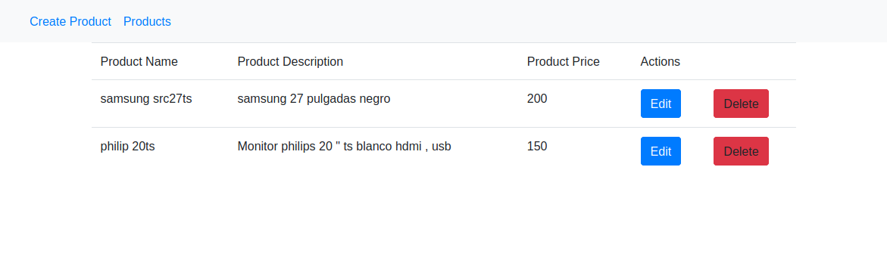

Angular 8 Tutorial With Example | Learn Angular 8 CRUD From Scratch is today’s topic. In this blog, we have previously described Angular 7 CRUD and Angular 6 CRUD. Now, the Angular community has released the next version, which is Angular 8. If you do not know how to upgrade Angular CLI to version 8, then check out my Angular CLI 8 upgrade tutor… https://appdividend.com/2019/06/04/an…

# Angular8tutorial

This project was generated with [Angular CLI](https://github.com/angular/angular-cli) version 8.0.1.

## Development server

Run `ng serve` for a dev server. Navigate to `http://localhost:4200/`. The app will automatically reload if you change any of the source files.

## Code scaffolding

Run `ng generate component component-name` to generate a new component. You can also use `ng generate directive|pipe|service|class|guard|interface|enum|module`.

## Build

Run `ng build` to build the project. The build artifacts will be stored in the `dist/` directory. Use the `--prod` flag for a production build.

## Running unit tests

Run `ng test` to execute the unit tests via [Karma](https://karma-runner.github.io).

## Running end-to-end tests

Run `ng e2e` to execute the end-to-end tests via [Protractor](http://www.protractortest.org/).

## Further help

To get more help on the Angular CLI use `ng help` or go check out the [Angular CLI README](https://github.com/angular/angular-cli/blob/master/README.md).
